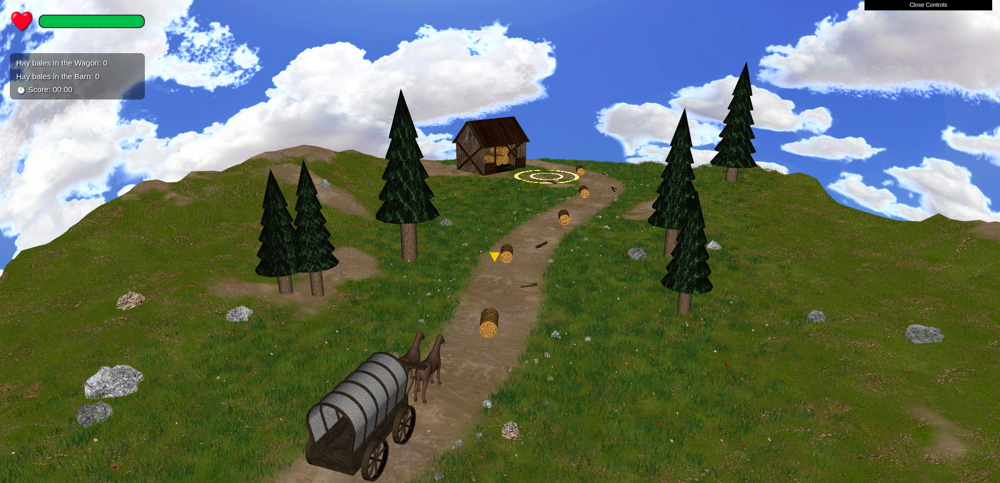
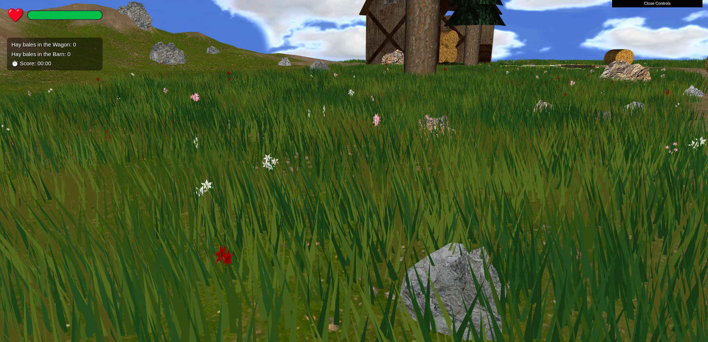
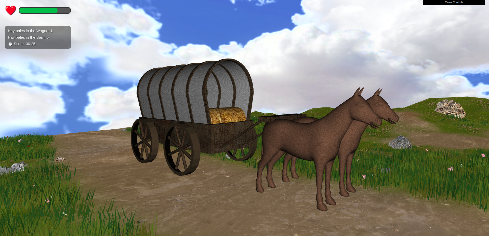

# CG Project : Spring Prairie
 
**Course:** Computer Graphics (CGRA) : L.EIC  
**Class section:** T03  
**Group:** T03G03
 
## Group Members
 
| Name | Number | E-Mail |
| --- | --- | --- |
| Ana Catarina Caires | 202006723 | up202006723@up.pt |
| Ana Margarida Ribeiro | 202305264 | up202305264@up.pt |
 

## Scene Description
 
A spring prairie landscape featuring an interactive wagon that the player drives around to collect hay bales and deliver them to a barn. The scene includes a dynamic sky, animated grass and flowers, trees, rocks, and scattered obstacles.
 
 
## How to Run
 
No installation required. The project runs directly in the browser using WebGL.
 
1. Make sure you have a local server running (e.g. VS Code Live Server, or `python -m http.server`)
2. Open `http://localhost:<port>/project/` in your browser
3. The scene will load automatically

 
## Keyboard Controls
 
| Key | Action |
| --- | --- |
| W | Accelerate forward |
| S | Brake |
| A | Turn left |
| D | Turn right |
| P | Pick up nearby hay bale |
| L | Drop hay bale |
| F | Change camera view |

 
## Implemented Features
 
- **Sky** : Animated skybox with sky, sun and clouds
- **Terrain** : Height-map based terrain with valley shape
- **Grass** : Animated wind-like movement via vertex shader
- **Flowers** : Scattered flowers with animation
- **Trees and bushes** : Distributed across the scene
- **Rocks** : Procedurally shaped via shader (FBM noise)
- **Wagon** : Fully modelled with wheels, cloth cover, and two horses; steerable and animated
- **Hay bales** : Collectible objects scattered across the pathway
- **Barn** : Detailed textured structure as the delivery point
- **Gameplay system** : HP management (time-based depletion, collection, delivery), game over and restart
- **Collision detection** : Sphere-based collision between wagon and obstacles
- **HUD** : HP bar, bale counts, score timer, damage and heal feedback
- **Shaders** : Animated directional arrow indicators above hay bales and barn. Used for rocks vertex noise, flowers and grass wind-like movement.

## Known issues & Limitations
- **Collision Logic can fail sometimes**: We had difficulties developing the collision logic between the wagon/horse and the obstacles on the pathway. For some of the last obstacles, the coordinates used as the center of the radius might not perfectly match the coordinates of those obstacles, causing the wagon/horse group to crash into "invisible" obstacles.
- **Height of procedural generation of elements**: We had some trouble matching the height of the generated elements to the terrain, so we solved it using the same logic applied to the terrain(in the shaders). It is not 100% accurate, especially in the higher parts of the map.

## Screenshots
### Screenshot 1 — Overall scene overview (wide angle)

### Screenshot 2 — Flower rocks and floor detail

### Screenshot 3 — Wagon close-up (showing model detail, textures)

### Animated screenshot 4 — A Shader animation (animated GIF)

## AI in the project

- **Shader Implementation**: AI was used as support for the shader implementation, helping us with the noise functions, selecting the most appropriate one for the type of geometric object we were using, and also to create wind-like movement.
- **Initial Procedural Generation of the Rocks**: AI supported us in the first procedural generation we did, the rocks, and from that we adjusted it to the other elements of the scene.
- **Procedural Generation of the Clump of grass**: We initially used the same procedural logic for the grass as we did for the rest of the scene elements. However, the high density of grass led to an excessive number of matrix multiplications, causing significant performance issues. Since we wanted to maintain a high grass density for a better visual result, we used AI to find and implement the best optimization approach.
- **Cleaning Code**: It was used to clean up our project by finding and removing unused code.
